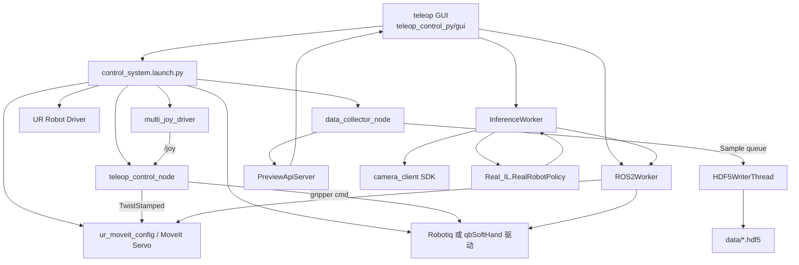
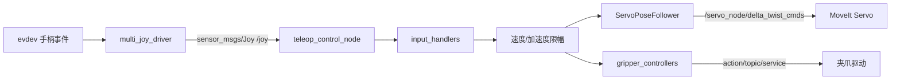
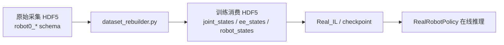

# 项目全景分析

## 1. 项目定位

这个仓库不是单一程序，而是一个面向真实 UR 机械臂的数据采集与在线推理工作区，核心目标可以概括为三件事：

1. 用 GUI 统一拉起机器人、夹爪、相机、遥操作和采集链路。
2. 把真实机器人操作过程落成 HDF5 数据集。
3. 用裁剪后的 `Real_IL` 推理模块加载训练好的 checkpoint，在线输出动作。

当前仓库的主工作模式是：

- 人类示教模式：`GUI -> teleop_control_node -> MoveIt Servo -> UR + gripper`
- 数据采集模式：`data_collector_node -> HDF5WriterThread -> data/*.hdf5`
- 模型执行模式：`GUI -> InferenceWorker -> Real_IL.RealRobotPolicy -> ROS2Worker -> Servo/Gripper`

---

## 2. 一句话结论

从维护者视角看，这个项目的真正核心不是某一个模型文件，而是 `src/teleop_control_py` 这个控制平面：

- GUI 是操作入口和编排器。
- `control_system.launch.py` 是运行时装配器。
- `teleop_control_node.py` 是人类输入到机器人动作的标准化控制节点。
- `data_collector_node.py` 是状态缓存、主动抓双相机、数据有效性校验、写盘和 Home/Home Zone 控制中心。
- `Real_IL` 在这个仓库里应被视为“推理适配模块”，不是完整训练系统。

---

## 3. 仓库边界

### 3.1 自研核心

| 路径 | 角色 | 说明 |
| --- | --- | --- |
| `src/teleop_control_py` | 主核心包 | 遥操作、采集、GUI、推理桥接都在这里 |
| `src/multi_joy_driver` | 输入驱动 | 自定义手柄驱动，统一发布 `/joy` |
| `scripts/teleop_gui.py` | 源码态启动器 | 直接从源码目录运行 GUI |
| `scripts/rebuild_dataset_schema.py` | 数据格式转换 | 把采集格式转成训练消费格式 |
| `scripts/downsample_hdf5.py` | 数据下采样 | 按频率下采样现有 HDF5 |

### 3.2 集成/外部依赖仓库

| 路径 | 角色 | 说明 |
| --- | --- | --- |
| `src/Universal_Robots_ROS2_Driver` | UR 官方 ROS2 驱动 | 提供机械臂驱动、控制器、MoveIt 相关能力 |
| `src/robotiq_2f_gripper_ros2` | Robotiq ROS2 驱动 | 提供 Robotiq 夹爪消息、硬件接口和动作接口 |
| `src/qbsofthand_control` | qbSoftHand ROS2 控制节点 | 自定义 C++ 节点，提供 `SetClosure` 服务 |
| `Real_IL` | 推理模块 | 基于你的训练代码裁剪而来，当前定位是推理侧适配层 |

### 3.3 运行资产

| 路径 | 角色 |
| --- | --- |
| `models/` | 推理 checkpoint、Hydra 配置、scaler |
| `data/` | 原始采集数据、重建后训练格式数据 |
| `src/teleop_control_py/config/*.yaml` | 遥操作、采集、GUI 默认配置 |

---

## 4. 顶层架构图



---

## 5. 核心模块关系

## 5.1 `teleop_control_py` 内部结构

```text
teleop_control_py
├── launch/
│   ├── control_system.launch.py      # 全系统装配入口
│   └── teleop_control.launch.py      # 仅拉起 teleop_control_node
├── gui/
│   ├── app.py                        # GUI 入口
│   ├── main_window.py                # 主窗口，负责子进程编排和推理调度
│   ├── ros_worker.py                 # GUI 内部 ROS2 监听/服务调用/推理动作下发
│   └── http_preview_worker.py        # 通过 HTTP 拉取采集节点预览图
├── teleop_control_node.py            # 人类输入 -> 标准化动作输出
├── input_handlers.py                 # joy / mediapipe 输入统一抽象
├── gripper_controllers.py            # robotiq / qbSoftHand 输出统一抽象
├── servo_pose_follower.py            # 向 MoveIt Servo 发 Twist，并负责自动切控制器/启动 Servo
├── data_collector_node.py            # 采集、校验、写盘、Home/Home Zone 中心
├── hdf5_writer.py                    # 后台异步写盘线程
├── preview_api.py                    # 本地 HTTP 预览接口
├── camera_client.py                  # RealSense / OAK-D SDK 拉帧
├── dataset_rebuilder.py              # 原始采集格式 -> 训练格式
├── model_inference.py                # GUI 对接 Real_IL 的桥接层
├── home_zone_utils.py                # Home Zone 采样与位姿误差驱动
└── transform_utils.py                # 数学工具与动作拼装
```

## 5.2 模块依赖方向

项目整体依赖方向比较清晰：

- GUI 依赖 launch、ROS 监听器、推理桥接器。
- `teleop_control_node` 依赖输入抽象、夹爪抽象、机械臂输出抽象。
- `data_collector_node` 依赖相机客户端、写盘线程、预览 API、Home Zone 工具。
- `model_inference.py` 依赖 `Real_IL.real_robot.infer.RealRobotPolicy`，但只关心推理，不负责训练。

这意味着项目在设计上采用了“上层编排，底层策略化”的方式：

- 输入源可替换：`JoyInputHandler` / `MediaPipeInputHandler`
- 夹爪后端可替换：`RobotiqController` / `QbSoftHandController`
- 相机后端可替换：`RealSenseClient` / `OAKClient`

---

## 6. 运行链路详解

## 6.1 遥操作链路



关键点：

- `multi_joy_driver` 通过 `evdev` 直接读 Linux 输入设备，统一转成 ROS2 `/joy`。
- `teleop_control_node` 本身不关心设备细节，它只做参数装配、选择输入策略、做限幅与调度。
- `input_handlers.py` 把不同输入统一成 `(Twist, gripper_value)`。
- `ServoPoseFollower` 不只是发 `TwistStamped`，还会自动：
  - 启动 `/servo_node/start_servo`
  - 通过 `controller_manager` 把控制器切换到 teleop controller
- 夹爪层统一暴露 `set_gripper(value)`：
  - Robotiq 优先用 action 接口
  - qbSoftHand 优先用 `SetClosure` 服务，失败时退回话题

## 6.2 MediaPipe 遥操作链路

`mediapipe` 模式不是单独节点，而是内嵌在 `teleop_control_node` 的 `MediaPipeInputHandler` 里。

其数据流是：

```text
相机图像 topic
  -> MediaPipeInputHandler
  -> 手部关键点/深度/死手(deadman)处理
  -> 末端目标速度或目标位姿偏差
  -> Twist + gripper
  -> teleop_control_node 后续同 joy 模式处理
```

这意味着：

- `teleop_control_node` 既是“控制节点”，也是“手势识别消费节点”。
- GUI 在 mediapipe 模式下只需要告诉它订阅哪个图像 topic。
- `control_system.launch.py` 只有在 `input_type=mediapipe` 时才会考虑拉起 RealSense ROS2 驱动。

## 6.3 GUI 编排链路

GUI 是整个系统的控制平面，不是单纯显示界面。

它做了四类事：

1. 子进程编排
   - 启停相机 ROS2 驱动
   - 启停机械臂驱动
   - 启停整套 teleop 系统
   - 启停采集节点

2. ROS2 内部监听
   - 通过 `ROS2Worker` 订阅机器人状态
   - 调用 `/data_collector/*` 服务
   - 在推理执行模式下直接发动作

3. 推理调度
   - 选择 checkpoint、task embedding、任务名
   - 启动 `InferenceWorker`
   - 把模型输出动作转交给 `ROS2Worker`

4. 数据维护
   - 打开预览窗口
   - 打开 HDF5 查看器
   - 支持 demo 裁剪、删除、转换训练格式

这里最重要的架构判断是：

- GUI 不是 ROS2 launch 文件的替代品。
- GUI 是“统一的人类操作台 + 运行状态观察台 + 推理调度器”。

## 6.4 采集链路

```mermaid
graph TD
    TIMER[record timer] --> PULL[data_collector_node 主动拉双相机]
    ROSSTATE[/joint_states / pose / twist / gripper] --> CACHE[状态缓存]
    PULL --> CHECK[时间戳/新鲜度/双相机偏差校验]
    CACHE --> CHECK
    CHECK --> SAMPLE[Sample 对象]
    SAMPLE --> QUEUE[queue.Queue]
    QUEUE --> WRITER[HDF5WriterThread]
    WRITER --> H5[data/*.hdf5]
    PULL --> PREVIEW[PreviewApiServer]
```

这个节点的设计和一般“相机 topic 回调即写盘”的采集方式不同，它是：

- 机器人状态：ROS 订阅缓存
- 图像：主动从 SDK 拉帧
- 录制：靠定时器节拍触发采样

这样做的后果是：

- 优点：
  - 可以统一控制采样频率
  - 可以在采样时同时检查状态新鲜度、双相机 skew、动作时间戳
  - 相机数据总是按“录制节拍”取最近值
- 代价：
  - 采集节点会直接占用 RealSense / OAK-D SDK
  - 不能和同一硬件的 ROS2 相机驱动并行使用

这也是 GUI 中会做“硬件占用冲突检查”的根本原因。

## 6.5 Home / Home Zone 链路

`go_home` 和 `go_home_zone` 都放在 `data_collector_node` 内实现，而不是 `teleop_control_node`。

这是一个非常重要的职责划分：

- `teleop_control_node` 负责“人类实时控制”
- `data_collector_node` 负责“采集相关动作流程”，包括：
  - 回 Home 点
  - 切换轨迹控制器
  - 执行 Home Zone 随机位姿扰动
  - 在 Home Zone 活跃时发布 `~/home_zone_active`

`teleop_control_node` 会订阅 `/data_collector/home_zone_active`：

- Home Zone 活跃时暂停 teleop 输出
- 如果检测到操作者重新输入，就主动调用 `/data_collector/cancel_home_zone`

这是一种“采集流程节点主导，teleop 节点配合让路”的协作模型。

## 6.6 预览链路

预览不是走 ROS 图像订阅，而是走本地 HTTP：

```text
data_collector_node
  -> PreviewApiServer
  -> /healthz
  -> /preview/global.jpg
  -> /preview/wrist.jpg
  -> GUI HttpPreviewWorker 轮询
  -> CameraPreviewWindow 显示
```

这样做的优点是：

- GUI 不需要额外处理 ROS Image 解码
- 预览和采集主逻辑解耦
- GUI 可以在非 ROS 图像消费场景下直接复用

---

## 7. 数据模型

## 7.1 原始采集格式

`data_collector_node` 当前写入的是“原始采集格式”，与 `HDF5WriterThread` 的 `Sample` 结构完全一致：

```text
/data/demo_x/
├── actions                  (N, 7)
└── obs/
    ├── agentview_rgb        (N, 224, 224, 3)
    ├── eye_in_hand_rgb      (N, 224, 224, 3)
    ├── robot0_joint_pos     (N, 6)
    ├── robot0_gripper_qpos  (N, 1)
    ├── robot0_eef_pos       (N, 3)
    └── robot0_eef_quat      (N, 4)
```

`actions` 语义固定为：

```text
[vx, vy, vz, wx, wy, wz, gripper]
```

也就是：

- 前 3 维：末端线速度命令
- 中 3 维：末端角速度命令
- 最后 1 维：夹爪开合命令

这个格式是“控制命令导向”的，而不是“末端绝对目标位姿导向”的。

## 7.2 当前仓库里实际观察到的原始文件

通过 `h5ls` 观察：

- `data/libero_demos.hdf5` 是原始采集格式
- `data/cucumber.hdf5` 也是原始采集格式

例如 `data/libero_demos.hdf5` 中存在：

- `demo_0/actions -> (1022, 7)`
- `demo_1/actions -> (506, 7)`
- `demo_3/actions -> (0, 7)`

这说明原始采集格式具有两个维护特征：

1. 数据集是可追加、可扩展的（dataset 第一维是 `Inf`）
2. 允许出现空 demo

空 demo 往往意味着：

- 开始录制后很快停止
- 写盘前没有成功采到有效样本

## 7.3 重建后的训练消费格式

`dataset_rebuilder.py` 会把原始采集格式重建成更接近训练侧消费的结构：

```text
/data/demo_x/
├── actions        (N, 7)
├── dones          (N,)
├── rewards        (N,)
├── robot_states   (N, 7)
├── states         (N, 110)
└── obs/
    ├── agentview_rgb   (N, 224, 224, 3)
    ├── eye_in_hand_rgb (N, 224, 224, 3)
    ├── ee_pos          (N, 3)
    ├── ee_ori          (N, 3)   # 由 quat 转 rotvec
    ├── ee_states       (N, 6)
    ├── gripper_states  (N, 1)
    └── joint_states    (N, 6)
```

也就是说，`dataset_rebuilder.py` 的本质工作是：

- 重命名和规范化字段
- 增补训练常见字段：`dones`、`rewards`、`robot_states`、`states`
- 把 `eef_quat` 转成 `ee_ori(rotvec)`

## 7.4 数据流图



---

## 8. `Real_IL` 的真实定位

根据你的说明，这里必须明确：

> `Real_IL` 是一个推理模块，基于你的训练代码删减改来。

所以在这个仓库里，`Real_IL` 不应被理解为“完整训练系统”，而应被理解为：

- 保留了 agent / encoder / backbone / scaler / hydra checkpoint 兼容逻辑
- 保留了任务 embedding 与在线推理入口
- 训练相关配置和部分结构仍有残留
- 但当前工作区里真正完整、自洽的是“在线推理链”，不是训练链

## 8.1 推理链入口

推理侧真正入口是：

- `Real_IL/real_robot/infer.py`
- 对外暴露类：`RealRobotPolicy`

`RealRobotPolicy` 的职责是：

1. 读取 checkpoint 目录下的 `.hydra/config.yaml`
2. 用 Hydra 实例化 `agents.*`
3. 加载 `last_model.pth`
4. 加载 `model_scaler.pkl`
5. 设置任务目标
   - 文字任务描述
   - 或 task embedding
6. 接收图像/机器人状态，输出动作

## 8.2 `Real_IL` 内部模块层次

```text
Real_IL
├── real_robot/infer.py              # 在线推理入口，定义 RealRobotPolicy
├── agents/base_agent.py             # 时序缓存、replan_every、predict 基类
├── agents/bc_agent.py               # BC agent
├── agents/ddim_agent.py             # DDIM agent
├── agents/encoders/                 # 图像编码器、语言编码器
├── agents/backbones/                # transformer / mamba / xlstm 等主干
├── agents/models/                   # bc / ddim / ddpm / flow_matching
├── agents/utils/scaler.py           # scaler 与逆归一化
└── task_embeddings/                 # 任务 embedding 生成与存储
```

## 8.3 当前推理闭环

在本仓库中，GUI 的推理闭环是：

```mermaid
graph TD
    GUI[TeleopMainWindow] --> INFW[InferenceWorker]
    INFW --> CAM[RealSenseClient / OAKClient]
    INFW --> POLICY[RealRobotPolicy]
    POLICY --> AGENT[BaseAgent + DDIM/BC Agent]
    AGENT --> ACTION[7维动作]
    ACTION --> ROSW[ROS2Worker]
    ROSW --> SERVO[/servo_node/delta_twist_cmds]
    ROSW --> GRIPPER[gripper controller]
```

细节上，`InferenceWorker` 会做：

- 直接打开相机 SDK
- 拉取两路图像
- 中心裁切并 resize 到模型需要的尺寸
- 调用 `policy.predict_action(...)`
- 把动作发给 GUI
- GUI 再把动作传给 `ROS2Worker`
- `ROS2Worker` 决定是否真的下发到机器人

## 8.4 时间维与重规划

`BaseAgent.predict()` 的行为不是“每次只预测一步动作”这么简单，它内部会：

- 缓存最近 `obs_seq_len` 的观测序列
- 在 `_steps_since_plan == 0` 时一次性预测整个动作序列
- 然后按 `replan_every` 逐步执行缓存动作

这说明模型侧的控制范式是：

- 以“短时动作序列规划 + 在线重规划”为主
- GUI/ROS2Worker 只是执行当前步输出

## 8.5 一个很容易误判的点

推理桥接层 `model_inference.py` 会把机器人状态拼成 7 维：

```text
[6 个关节 + 1 个 gripper]
```

但是当前示例 checkpoint `models/ddim_dec_transformer/.hydra/config.yaml` 中：

- `if_robot_states: false`

这意味着：

- 推理接口支持传入机器人状态
- 但至少当前示例模型配置并没有启用它
- 所以“GUI 有状态输入”不等于“当前模型一定消费了状态”

## 8.6 为什么看起来还有训练残留

当前 checkpoint 配置里仍然引用：

- `real_robot.datasets.real_robot_dataset.RealRobotDataset`
- `real_robot.trainers.real_trainer.RealTrainer`

但这些模块在当前仓库快照里并不存在。

这不应解读为“仓库损坏”，更合理的解释是：

- `Real_IL` 是从训练代码中裁剪出来的推理版本
- 训练配置残留被保存在 checkpoint 的 Hydra 配置中
- 当前仓库保留的是推理所需的 agent/encoder/model/scaler 兼容层

---

## 9. 关键接口一览

## 9.1 ROS topic / service 关系

| 接口 | 生产者 | 消费者 | 作用 |
| --- | --- | --- | --- |
| `/joy` | `multi_joy_driver` | `teleop_control_node` | 手柄输入 |
| `/servo_node/delta_twist_cmds` | `teleop_control_node` / `ROS2Worker` | MoveIt Servo | 机械臂速度控制 |
| `/gripper/cmd` | gripper controller | `data_collector_node` / GUI | 夹爪状态代理 |
| `/joint_states` | UR 驱动 | `data_collector_node` / GUI | 关节状态 |
| `/tcp_pose_broadcaster/pose` | UR/MoveIt | `data_collector_node` / GUI / MediaPipe 输入 | 末端位姿 |
| `/data_collector/start` | `data_collector_node` | GUI | 开始录制 |
| `/data_collector/stop` | `data_collector_node` | GUI | 停止录制 |
| `/data_collector/go_home` | `data_collector_node` | GUI | 回 Home |
| `/data_collector/go_home_zone` | `data_collector_node` | GUI | 回 Home Zone |
| `/data_collector/cancel_home_zone` | `data_collector_node` | GUI / `teleop_control_node` | 取消 Home Zone |
| `/data_collector/home_zone_active` | `data_collector_node` | `teleop_control_node` | Teleop 暂停/恢复握手 |
| `/data_collector/record_stats` | `data_collector_node` | GUI | 录制统计 |

## 9.2 本地 HTTP 接口

| 接口 | 提供者 | 用途 |
| --- | --- | --- |
| `GET /healthz` | `PreviewApiServer` | GUI 健康检查 |
| `GET /preview/global.jpg` | `PreviewApiServer` | 拉全局视角图 |
| `GET /preview/wrist.jpg` | `PreviewApiServer` | 拉手腕视角图 |

---

## 10. 这个项目最重要的几个隐性约束

## 10.1 机器人控制权只能有一个主源

系统明确阻止以下冲突：

- 遥操作执行中，再启动推理执行
- 推理执行中，再启动遥操作

因为两者最终都会往同一个 Servo/夹爪输出链路写控制命令。

## 10.2 采集节点和相机 ROS2 驱动会争用硬件

`data_collector_node` 与 `InferenceWorker` 都直接使用相机 SDK：

- RealSense: `pyrealsense2`
- OAK-D: `depthai`

这意味着它们不是简单订阅 ROS 图像 topic，而是直接占设备。

因此：

- 采集节点不能和同一相机的 ROS2 驱动并行
- 推理模块也不能和同一相机的采集/ROS2 驱动并行

GUI 中大量“硬件占用冲突”判断都是围绕这个事实展开的。

## 10.3 Home/Home Zone 属于采集流程，不属于 teleop

这是当前职责边界里非常合理的一点：

- Teleop 负责实时控制
- Collector 负责采集辅助流程

所以维护时不要把 Home Zone 逻辑误塞进 `teleop_control_node`。

## 10.4 这个仓库同时维护两种 HDF5 语义

有两套 schema：

1. 原始采集 schema
2. 训练消费 schema

这不是冗余，而是有意分层：

- 原始 schema 方便低耦合高速写盘
- 训练 schema 方便下游算法统一读取

## 10.5 GUI 才是真正的运维入口

虽然所有节点都可以手动 `ros2 run/launch`，但从项目形态看：

- README 推荐 GUI
- GUI 管理子进程、预览、状态、推理、数据维护
- GUI 内置了冲突检查、参数覆盖和恢复逻辑

因此日常维护应默认把 GUI 视为一等入口。

---

## 11. 推荐阅读顺序

如果要继续深度维护，建议按这个顺序读代码：

1. `README.md`
2. `src/teleop_control_py/launch/control_system.launch.py`
3. `src/teleop_control_py/teleop_control_py/gui/main_window.py`
4. `src/teleop_control_py/teleop_control_py/teleop_control_node.py`
5. `src/teleop_control_py/teleop_control_py/input_handlers.py`
6. `src/teleop_control_py/teleop_control_py/gripper_controllers.py`
7. `src/teleop_control_py/teleop_control_py/data_collector_node.py`
8. `src/teleop_control_py/teleop_control_py/hdf5_writer.py`
9. `src/teleop_control_py/teleop_control_py/model_inference.py`
10. `Real_IL/real_robot/infer.py`

---

## 12. 最终判断

这个项目当前的真实架构可以用一句话概括：

> 这是一个以 `teleop_control_py` 为中枢、以 GUI 为运维入口、以 `data_collector_node` 为采集核心、以 `Real_IL` 为在线推理适配层的真实机器人工作区。

它最强的地方在于：

- 控制、采集、预览、推理都已经串起来了
- 抽象边界总体清楚
- 输入端、夹爪端、相机端都做了策略化封装

它最需要维护者时刻记住的地方在于：

- `Real_IL` 在这里是推理模块，不是完整训练系统
- 相机是 SDK 直连，不是统一 ROS 图像总线
- 原始采集格式和训练格式是两层数据语义，不要混为一谈
- 机器人控制权必须保持单主源

如果把这些边界守住，这个仓库的后续维护会比较稳。
