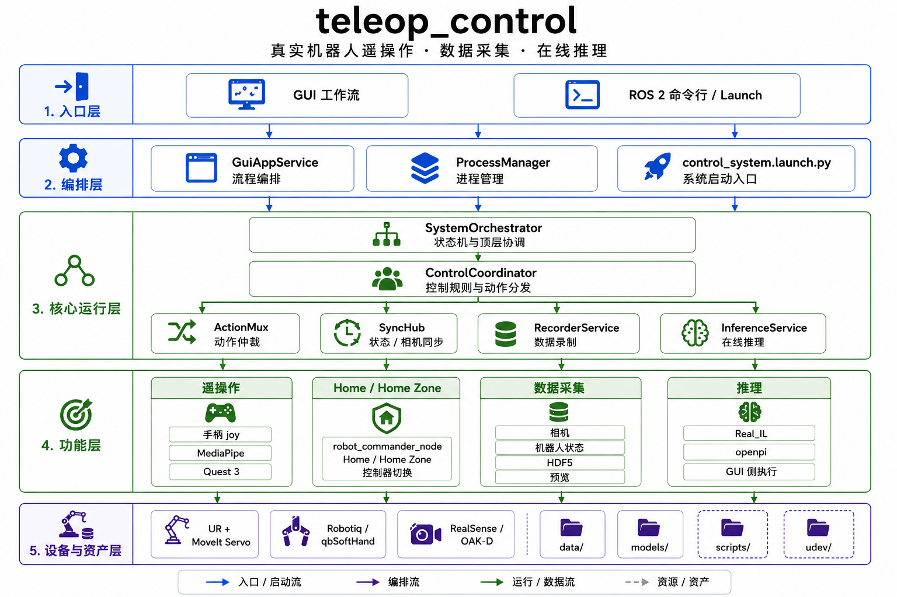
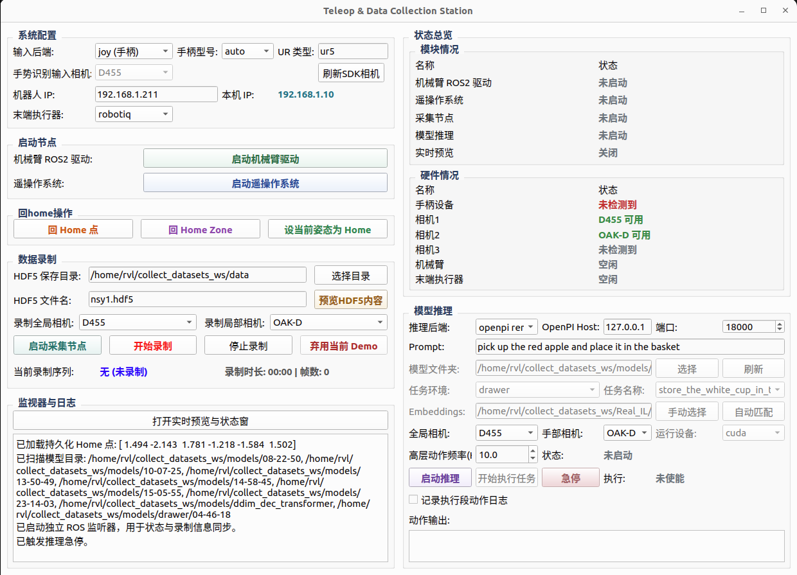

# teleop_control

中文 | [English](README_EN.md)

[](https://www.bilibili.com/video/BV13iQuB3E5L/)

> 视频演示：点击封面查看 B 站演示。

面向真实机械臂的 ROS 2 遥操作、数据采集与在线推理工作区。项目以 GUI 为主入口，围绕 UR5 + MoveIt Servo 控制链路组织机器人驱动、人工遥操作、HDF5 示教录制、预览和模型推理执行。

这个仓库按完整 workspace 维护：`teleop_control_py` 是主控包，UR、Robotiq、qbSoftHand、`Real_IL`、`openpi`、脚本、模型和数据目录共同组成日常运行环境。

## 功能概览

- 通过 GUI 启动和管理机械臂驱动、遥操作、采集和推理流程
- 支持 `joy`、`mediapipe`、`quest3` 三类输入后端
- 支持 `robotiq` 和 `qbsofthand` 夹爪配置
- 通过双相机和机器人状态同步录制 HDF5 示教数据
- 提供 `Home`、`Home Zone`、控制器切换和录制服务接口
- 支持模型加载、推理预览和推理动作执行

## 工作区组成

| 路径 | 作用 |
| --- | --- |
| `src/teleop_control_py/` | 主控 ROS 2 包，包含 GUI、控制、采集、推理桥接和配置 |
| `src/Universal_Robots_ROS2_Driver/` | UR 官方 ROS 2 driver、controller 和 MoveIt 配置 |
| `src/robotiq_2f_gripper_ros2/` | Robotiq 2F 夹爪相关 ROS 2 包 |
| `src/qbsofthand_control/` | qbSoftHand 控制包 |
| `Real_IL/` | 本地模仿学习推理仓库 |
| `openpi/` | 远端 openpi 推理相关仓库 |
| `scripts/` | workspace 级工具脚本 |
| `data/` | 本地采集数据、预览录屏和推理日志 |
| `models/` | 本地模型和权重目录 |
| `udev/` | 设备规则 |

## 架构概览

项目按入口、编排、核心运行、功能、设备与资产五层组织：



主要职责：

- GUI 负责流程编排、状态显示和用户操作入口。
- `core` 模块提供状态机、动作仲裁、同步采样、录制和推理生命周期管理。
- `teleop_control_node` 处理人工输入并下发遥操作动作。
- `robot_commander_node` 提供 `Home`、`Home Zone` 和控制器切换能力。
- `data_collector_node` 负责相机采样、状态同步和 HDF5 写盘。
- `ROS2Worker` 是 GUI 侧 ROS 桥接层，也承接推理执行链路。

更完整的职责边界和运行链路见 [docs/guide/01-architecture.md](docs/guide/01-architecture.md)。

## 快速开始

### 环境前提

建议环境：

- Ubuntu 22.04
- ROS 2 Humble
- Python 3.10
- 已安装 UR 驱动、MoveIt Servo、对应夹爪驱动

`requirements.txt` 只包含本工作区的 Python 依赖。ROS 2 系统包请通过 ROS 2 / apt 安装。

### 安装依赖

```bash
pip install -r requirements.txt
```

如果需要使用 `Real_IL` 推理，请将仓库放在当前项目根目录，并保持目录名为 `Real_IL`：

```bash
git clone https://github.com/niconekomimi/Real_IL.git Real_IL
pip install -r Real_IL/requirements.txt
```

### 编译

```bash
source /opt/ros/humble/setup.bash
colcon build
source install/setup.bash
```

日常只改主控包时，也可以只编译 `teleop_control_py`：

```bash
colcon build --packages-select teleop_control_py
```

### 启动 GUI

推荐入口：

```bash
ros2 run teleop_control_py teleop_gui
```



## GUI 推荐工作流

1. 在 GUI 里选择 `ur_type`、机器人 IP、输入后端、夹爪类型
2. 如果选择 `quest3`，先确认 Quest bridge 已运行，并在 Quest 头显中打开对应网页后点击进入 `VR` 模式
3. 启动机械臂驱动
4. 启动遥操作系统
5. 启动采集节点
6. 开始录制 / 停止录制 / 弃用最近 Demo
7. 根据需要执行 `Go Home` / `Go Home Zone` / `设当前姿态为 Home`
8. 需要模型执行时，启动推理并再单独使能推理执行

## 命令行入口

启动整套控制系统：

```bash
ros2 launch teleop_control_py control_system.launch.py
```

常用参数组合：

```bash
ros2 launch teleop_control_py control_system.launch.py input_type:=joy gripper_type:=robotiq
ros2 launch teleop_control_py control_system.launch.py input_type:=joy gripper_type:=qbsofthand
ros2 launch teleop_control_py control_system.launch.py input_type:=mediapipe gripper_type:=robotiq
ros2 launch teleop_control_py control_system.launch.py input_type:=quest3 gripper_type:=robotiq
```

同时启动采集节点：

```bash
ros2 launch teleop_control_py control_system.launch.py \
    input_type:=joy \
    gripper_type:=robotiq \
    enable_data_collector:=true
```

更多分离启动、参数调试和 Quest3 专项说明见：

- [docs/guide/03-operation.md](docs/guide/03-operation.md)
- [docs/guide/07-devices.md](docs/guide/07-devices.md)

单独启动采集节点：

```bash
ros2 run teleop_control_py data_collector_node \
    --ros-args \
    --params-file src/teleop_control_py/config/data_collector_params.yaml
```

## 常用服务

```bash
ros2 service call /data_collector/start std_srvs/srv/Trigger {}
ros2 service call /data_collector/stop std_srvs/srv/Trigger {}
ros2 service call /data_collector/discard_last_demo std_srvs/srv/Trigger {}
ros2 service call /commander/go_home std_srvs/srv/Trigger {}
ros2 service call /commander/go_home_zone std_srvs/srv/Trigger {}
```

## 可复现程度

这是一个面向真实硬件的机器人工作区。代码、launch 参数、配置结构和文档可以直接阅读和复用；完整运行需要对应硬件和本地环境。

需要真实硬件或现场环境的部分：

- UR 机械臂、UR driver 网络配置和 MoveIt Servo 控制链路
- Robotiq 或 qbSoftHand 夹爪
- RealSense / OAK-D 相机
- Quest 3 WebXR 输入
- 本地模型权重、示教数据和机器人现场 IP / 设备序列号

可以脱离硬件阅读或复用的部分：

- GUI、launch、ROS 节点和模块边界
- `SystemOrchestrator`、`ControlCoordinator`、`ActionMux` 控制规则设计
- HDF5 数据采集链路和数据结构说明
- `Real_IL` / `openpi` 推理后端接入方式
- `docs/guide/` 中的架构、运行和配置说明

第三方依赖说明：

- `Real_IL/` 和 `openpi/` 作为外部模型仓库在本地单独获取，不随本仓库提交。
- `data/`、`models/`、`build/`、`install/`、`log/` 等本地运行产物不作为源码发布。
- README 中的启动命令面向真实硬件环境，运行前需要按自己的机器人 IP、相机序列号、夹爪设备和模型路径调整配置。

## 文档

正式项目文档和维护上下文分开维护：

- [docs/guide/00-overview.md](docs/guide/00-overview.md)：workspace 概览和文档阅读顺序
- [docs/guide/01-architecture.md](docs/guide/01-architecture.md)：架构分层和运行边界
- [docs/guide/03-operation.md](docs/guide/03-operation.md)：GUI 与命令行启动方式
- [docs/guide/08-configuration.md](docs/guide/08-configuration.md)：配置文件职责和覆盖规则
- [docs/agent/00-current-state.md](docs/agent/00-current-state.md)：当前维护状态
- [docs/agent/01-todo.md](docs/agent/01-todo.md)：人工和 AI 共用的任务队列

## 关键路径

- `src/teleop_control_py/launch/control_system.launch.py`
- `src/teleop_control_py/launch/teleop_control.launch.py`
- `src/teleop_control_py/config/`
- `src/teleop_control_py/teleop_control_py/core/`
- `src/teleop_control_py/teleop_control_py/gui/`
- `src/teleop_control_py/teleop_control_py/nodes/`
- `src/Universal_Robots_ROS2_Driver/`
- `src/robotiq_2f_gripper_ros2/`
- `src/qbsofthand_control/`
- `scripts/`
- `Real_IL/`
- `openpi/`
