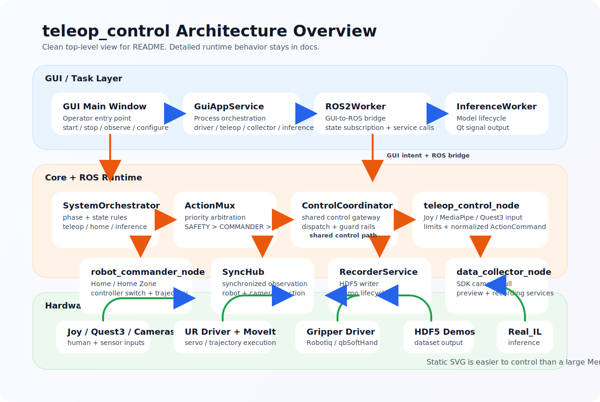

# teleop_control

中文 | [English](README_EN.md)

面向真实机械臂的遥操作、数据采集与在线推理工作区。当前主使用方式是通过 GUI 统一启动机械臂驱动、遥操作系统、采集节点和推理链路。

当前代码的真实实现说明见：

- [docs/PROJECT_ANALYSIS.md](docs/PROJECT_ANALYSIS.md)
- [docs/current_control_behavior_spec_v0.1.md](docs/current_control_behavior_spec_v0.1.md)
- [docs/QUEST3_WEBXR_VUER.md](docs/QUEST3_WEBXR_VUER.md)

## 项目定位

当前项目聚焦三件事：

- 通过 GUI 管理真实机器人控制链路
- 录制严格同步的 HDF5 示教数据
- 在线加载 `Real_IL` 模型并执行推理动作

当前默认组合：

- 机械臂：UR5 + MoveIt Servo
- 输入：`joy` / `mediapipe` / `quest3`
- 夹爪：`robotiq` 或 `qbsofthand`
- 采集格式：HDF5
- 主入口：GUI

## 架构图

下面这张图是项目当前采用的顶层分层总览图。README 里使用静态 `SVG`，避免大 `Mermaid` 在网页中出现换行、缩放和主题渲染问题。更细的运行时说明见 [docs/PROJECT_ANALYSIS.md](docs/PROJECT_ANALYSIS.md)。



当前实现上的几个关键事实：

- `teleop_control_node` 负责人工遥操作闭环。
- `robot_commander_node` 负责 `Home / Home Zone / controller switch`。
- `data_collector_node` 负责双相机采样、状态同步和 HDF5 录制。
- 推理执行当前仍通过 GUI 侧 `ROS2Worker` 桥接下发。
- `robot_profiles.yaml` 已经成为底层接口默认值主真源。

## 快速开始

## 1. 环境前提

建议环境：

- Ubuntu 22.04
- ROS 2 Humble
- Python 3.10
- 已安装 UR 驱动、MoveIt Servo、对应夹爪驱动

`requirements.txt` 只覆盖源码态 Python 依赖，不包含 ROS 2 系统包，例如：

- `rclpy`
- `cv_bridge`
- `geometry_msgs`
- `sensor_msgs`
- `controller_manager_msgs`

这些依赖应通过 ROS 2 / apt 安装。

## 2. 安装 Python 依赖

基础运行依赖：

```bash
pip install -r requirements.txt
```

如果你需要在线推理 `Real_IL`：

```bash
pip install -r Real_IL/requirements.txt
```

## 3. 编译工作区

```bash
source /opt/ros/humble/setup.bash
colcon build --packages-select teleop_control_py
source install/setup.bash
```

## 4. 启动 GUI

推荐入口：

```bash
ros2 run teleop_control_py teleop_gui
```


## GUI 推荐工作流

推荐顺序：

1. 在 GUI 里选择 `ur_type`、机器人 IP、输入后端、夹爪类型
2. 如果选择 `quest3`，先确认 Quest bridge 已运行，并在 Quest 头显中打开对应网页后点击进入 `VR` 模式
3. 启动机械臂驱动
4. 启动遥操作系统
5. 启动采集节点
6. 开始录制 / 停止录制 / 弃用最近 Demo
7. 根据需要执行 `Go Home` / `Go Home Zone` / `设当前姿态为 Home`
8. 需要模型执行时，启动推理并再单独使能推理执行

当前 GUI 负责：

- 机械臂驱动进程管理
- 遥操作系统进程管理
- 采集节点进程管理
- 推理生命周期与执行开关
- 实时状态展示
- 相机与录制配置选择
- Home 点持久化覆盖

## 命令行入口

## 启动整套控制系统

```bash
ros2 launch teleop_control_py control_system.launch.py
```

常用示例：

手柄 + Robotiq：

```bash
ros2 launch teleop_control_py control_system.launch.py \
    input_type:=joy \
    gripper_type:=robotiq \
    robotiq_serial_port:=/dev/robotiq_gripper
```

手柄 + qbSoftHand：

```bash
ros2 launch teleop_control_py control_system.launch.py \
    input_type:=joy \
    gripper_type:=qbsofthand
```

MediaPipe + Robotiq：

```bash
ros2 launch teleop_control_py control_system.launch.py \
    input_type:=mediapipe \
    gripper_type:=robotiq
```

Quest3 + Robotiq：

```bash
ros2 launch teleop_control_py control_system.launch.py \
    input_type:=quest3 \
    gripper_type:=robotiq
```

说明：

- `input_type:=quest3` 时，`control_system.launch.py` 默认会自动启动 `quest3_webxr_bridge_node`
- Quest 侧推荐入口见 [docs/QUEST3_WEBXR_VUER.md](docs/QUEST3_WEBXR_VUER.md)

整套系统 + 采集节点：

```bash
ros2 launch teleop_control_py control_system.launch.py \
    input_type:=joy \
    gripper_type:=robotiq \
    enable_data_collector:=true
```

更多分离启动、参数调试和 Quest3 专项说明见：

- [docs/QUEST3_WEBXR_VUER.md](docs/QUEST3_WEBXR_VUER.md)
- [docs/current_control_behavior_spec_v0.1.md](docs/current_control_behavior_spec_v0.1.md)

## 单独启动采集节点

```bash
ros2 run teleop_control_py data_collector_node \
    --ros-args \
    --params-file src/teleop_control_py/config/data_collector_params.yaml
```

常用服务：

```bash
ros2 service call /data_collector/start std_srvs/srv/Trigger {}
ros2 service call /data_collector/stop std_srvs/srv/Trigger {}
ros2 service call /data_collector/discard_last_demo std_srvs/srv/Trigger {}
ros2 service call /commander/go_home std_srvs/srv/Trigger {}
ros2 service call /commander/go_home_zone std_srvs/srv/Trigger {}
```

## 当前系统行为摘要

当前代码的关键行为：

- `teleop` 与 `inference execution` 当前互斥
- `Home / Home Zone` 高于遥操作
- 如果 GUI 当前正在执行推理，发起 `Home / Home Zone` 时会先停止推理执行
- `quest3` 当前已经接入为正式输入后端，不再只是 bridge 原型
- `quest3` 默认采用 `relative pose + clutch + hand_relative orientation`，输入层默认关闭低通滤波
- `quest3` 支持 Quest2ROS 风格的相对 frame 重置，默认只作用于 `active_hand`
- `Home` 通过 trajectory controller 执行
- `Home Zone` 先回 Home，再切回 Servo 控制做位姿扰动
- `Home Zone` 不会被新的人工输入自动取消
- 录制主链路使用 SDK 相机主动拉帧，不以 ROS 图像 topic 为主采样路径

## 配置文件分工

| 文件 | 作用 |
| --- | --- |
| `src/teleop_control_py/config/robot_profiles.yaml` | 底层机械臂 / 夹爪 / ROS 接口默认值真源 |
| `src/teleop_control_py/config/teleop_params.yaml` | 遥操作行为配置；同时包含 Quest3 bridge 默认参数 |
| `src/teleop_control_py/config/data_collector_params.yaml` | 采集行为配置 |
| `src/teleop_control_py/config/gui_params.yaml` | GUI 默认值和上次选择 |
| `src/teleop_control_py/config/home_overrides.yaml` | 运行期 Home 点覆盖 |
| `src/teleop_control_py/config/joy_driver_params.yaml` | 手柄驱动层配置 |

## 数据格式

当前 HDF5 以 `data/demo_N` 组织，典型字段包括：

- `obs/agentview_rgb`
- `obs/eye_in_hand_rgb`
- `obs/robot0_joint_pos`
- `obs/robot0_gripper_qpos`
- `obs/robot0_eef_pos`
- `obs/robot0_eef_quat`
- `actions`

当前 `actions` 的语义是命令动作：

```text
[vx, vy, vz, wx, wy, wz, gripper]
```

其中：

- 前 3 维是末端线速度命令
- 中间 3 维是末端角速度命令
- 最后 1 维是夹爪命令

## 常用脚本

| 脚本 | 作用 |
| --- | --- |
| `scripts/teleop_gui.py` | 源码态启动 GUI |
| `scripts/downsample_hdf5.py` | 对 HDF5 数据集做降采样 |
| `scripts/rebuild_dataset_schema.py` | 重建已有 HDF5 数据集结构 |

## 项目结构

关键路径：

- `src/teleop_control_py/launch/control_system.launch.py`
- `src/teleop_control_py/launch/teleop_control.launch.py`
- `src/teleop_control_py/config/`
- `src/teleop_control_py/teleop_control_py/core/`
- `src/teleop_control_py/teleop_control_py/gui/`
- `src/teleop_control_py/teleop_control_py/nodes/`
- `scripts/`
- `Real_IL/`

## 补充说明

- 根目录 `requirements.txt` 只面向当前工作区 Python 依赖。
- `Real_IL` 自身依赖在 `Real_IL/requirements.txt` 中单独维护。
- 如果你要看当前真实职责边界和状态机行为，不要只看 README，直接看：
  - [docs/PROJECT_ANALYSIS.md](docs/PROJECT_ANALYSIS.md)
  - [docs/current_control_behavior_spec_v0.1.md](docs/current_control_behavior_spec_v0.1.md)
