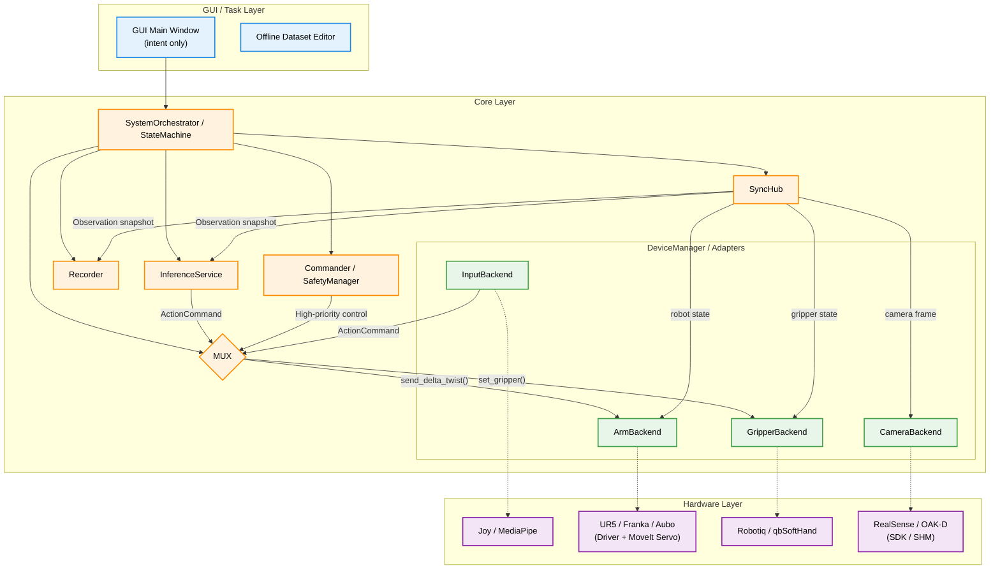
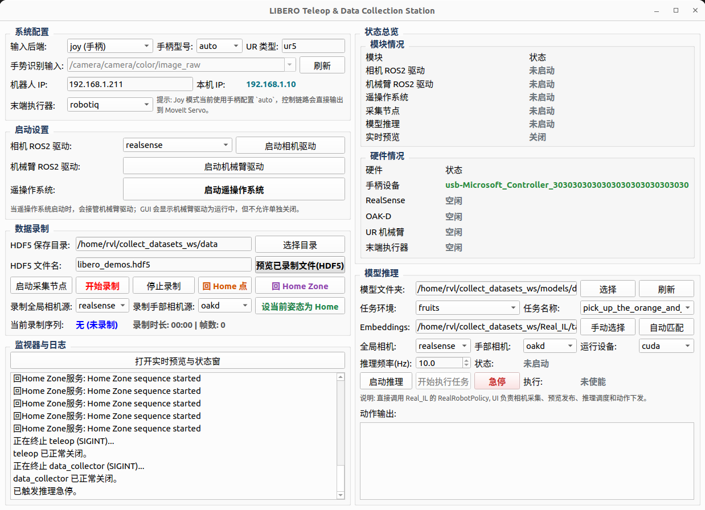

# teleop_control

[中文](README.md) | English

This workspace targets real-robot teleoperation, dataset collection, and online inference. The recommended entry point is the GUI, which manages the robot driver, teleop stack, collector, and inference lifecycle.

For the code-accurate architecture and behavior:

- [docs/PROJECT_ANALYSIS_EN.md](docs/PROJECT_ANALYSIS_EN.md)
- [docs/current_control_behavior_spec_v0.1_EN.md](docs/current_control_behavior_spec_v0.1_EN.md)

## Overview

Current focus:

- GUI-driven control of a real robot system
- Synchronized HDF5 demo recording
- Online `Real_IL` inference execution

Current default stack:

- Robot arm: UR5 + MoveIt Servo
- Input: `joy` / `mediapipe` / `quest3`
- Gripper: `robotiq` or `qbsofthand`
- Dataset format: HDF5
- Main entry: GUI

## Architecture

The following Mermaid diagram is the intended top-level architecture used by the project. The current implementation has already landed a large part of it, while some runtime responsibilities are still split across ROS nodes and the GUI bridge.



Implementation notes:

- `teleop_control_node` owns the manual teleop loop.
- `robot_commander_node` owns `Home / Home Zone / controller switch`.
- `data_collector_node` owns synchronized capture and HDF5 recording.
- Inference execution is still bridged by GUI-side `ROS2Worker`.
- `robot_profiles.yaml` is already the main source of default low-level interface values.

## Quick Start

## 1. Prerequisites

Recommended environment:

- Ubuntu 22.04
- ROS 2 Humble
- Python 3.10
- Installed UR driver, MoveIt Servo, and the matching gripper driver

`requirements.txt` only covers Python packages for this workspace. ROS 2 packages such as `rclpy`, `cv_bridge`, `geometry_msgs`, and `sensor_msgs` must be installed from ROS 2 / apt.

## 2. Install Python dependencies

Base workspace dependencies:

```bash
pip install -r requirements.txt
```

If you also want online `Real_IL` inference:

```bash
pip install -r Real_IL/requirements.txt
```

## 3. Build the workspace

```bash
source /opt/ros/humble/setup.bash
colcon build --packages-select teleop_control_py
source install/setup.bash
```

## 4. Launch the GUI

Recommended entry:

```bash
ros2 run teleop_control_py teleop_gui
```



## GUI Workflow

Typical order:

1. Select `ur_type`, robot IP, input backend, and gripper type
2. If `quest3` is selected, make sure the Quest bridge is running, then open the Quest webpage and click `Enter VR` / `Enter XR`
3. Start the robot driver
4. Start the teleop system
5. Start the collector node
6. Start / stop recording, or discard the last demo
7. Use `Go Home`, `Go Home Zone`, or `Set Current Pose as Home`
8. Start inference and then explicitly enable inference execution if needed

## CLI Entrypoints

Launch the full control system:

```bash
ros2 launch teleop_control_py control_system.launch.py
```

Examples:

```bash
ros2 launch teleop_control_py control_system.launch.py input_type:=joy gripper_type:=robotiq
ros2 launch teleop_control_py control_system.launch.py input_type:=joy gripper_type:=qbsofthand
ros2 launch teleop_control_py control_system.launch.py input_type:=mediapipe gripper_type:=robotiq
ros2 launch teleop_control_py control_system.launch.py input_type:=quest3 gripper_type:=robotiq
ros2 launch teleop_control_py control_system.launch.py input_type:=joy gripper_type:=robotiq enable_data_collector:=true
```

Notes:

- When `input_type:=quest3`, `control_system.launch.py` will auto-start `quest3_webxr_bridge_node`
- The recommended Quest entry URL and setup notes are documented in [docs/current_control_behavior_spec_v0.1_EN.md](docs/current_control_behavior_spec_v0.1_EN.md)

For Quest3-specific bringup details, split-launch workflows, and teleop mapping notes, see:

- [docs/PROJECT_ANALYSIS_EN.md](docs/PROJECT_ANALYSIS_EN.md)
- [docs/current_control_behavior_spec_v0.1_EN.md](docs/current_control_behavior_spec_v0.1_EN.md)

Collector-only launch:

```bash
ros2 run teleop_control_py data_collector_node \
    --ros-args \
    --params-file src/teleop_control_py/config/data_collector_params.yaml
```

Useful services:

```bash
ros2 service call /data_collector/start std_srvs/srv/Trigger {}
ros2 service call /data_collector/stop std_srvs/srv/Trigger {}
ros2 service call /data_collector/discard_last_demo std_srvs/srv/Trigger {}
ros2 service call /commander/go_home std_srvs/srv/Trigger {}
ros2 service call /commander/go_home_zone std_srvs/srv/Trigger {}
```

## Config Responsibilities

| File | Responsibility |
| --- | --- |
| `src/teleop_control_py/config/robot_profiles.yaml` | Default low-level robot / gripper / ROS interface truth |
| `src/teleop_control_py/config/teleop_params.yaml` | Teleop behavior; also contains default Quest3 bridge parameters |
| `src/teleop_control_py/config/data_collector_params.yaml` | Collection behavior |
| `src/teleop_control_py/config/gui_params.yaml` | GUI defaults and persisted user choices |
| `src/teleop_control_py/config/home_overrides.yaml` | Runtime Home overrides |
| `src/teleop_control_py/config/joy_driver_params.yaml` | Joystick driver config |

## Current Behavior Summary

Key current behavior:

- `teleop` and `inference execution` are mutually exclusive
- `Home / Home Zone` has higher priority than manual teleop
- If GUI-side inference execution is active, `Go Home / Go Home Zone` will stop inference execution first
- `quest3` is now a formal input backend, not just a bridge prototype
- `quest3` defaults to `relative pose + clutch + hand_relative orientation`, with input smoothing disabled by default
- `quest3` supports Quest2ROS-style relative frame reset, scoped to `active_hand` by default
- `Home` uses the trajectory controller
- `Home Zone` moves through the trajectory controller directly to a sampled target joint state near Home
- `Home Zone` is not automatically canceled by new manual input
- The collector uses SDK camera pulling as the primary recording path rather than ROS image topics

## Dataset Format

HDF5 demos are stored under `data/demo_N`, with fields such as:

- `obs/agentview_rgb`
- `obs/eye_in_hand_rgb`
- `obs/robot0_joint_pos`
- `obs/robot0_gripper_qpos`
- `obs/robot0_eef_pos`
- `obs/robot0_eef_quat`
- `actions`

Current action semantics:

```text
[vx, vy, vz, wx, wy, wz, gripper]
```

## Useful Scripts

| Script | Purpose |
| --- | --- |
| `scripts/teleop_gui.py` | Run the GUI from source |
| `scripts/downsample_hdf5.py` | Downsample an HDF5 dataset |
| `scripts/rebuild_dataset_schema.py` | Rebuild an existing HDF5 dataset layout |
