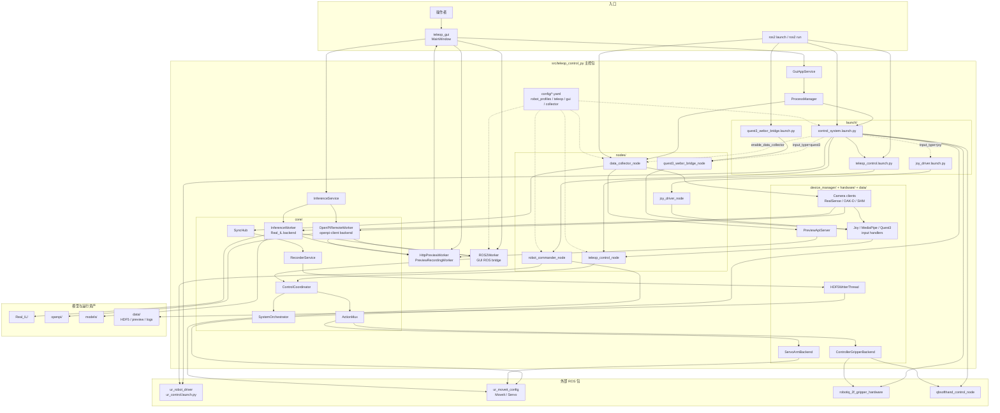

# 架构

更新时间：2026-05-06

`teleop_control` 是一个面向真实机器人运行的 ROS 2 工作区。系统不是单一大节点，而是由 GUI、ROS launch、若干专职 ROS 节点、共享 `core` 模块、硬件后端、外部 ROS 包和模型仓库共同组成。

## 顶层结构

## 分层职责

| 层 | 主要文件 | 职责 |
| --- | --- | --- |
| GUI | `gui/main_window.py`, `gui/app_service.py`, `gui/runtime/process_manager.py` | 用户界面、进程编排、配置选择、状态展示 |
| GUI ROS 桥 | `gui/ros_worker.py` | 订阅机器人状态，调用录制和 commander 服务，承接推理执行动作下发 |
| Core | `core/orchestrator.py`, `core/mux.py`, `core/control_coordinator.py`, `core/sync_hub.py`, `core/recorder.py`, `core/inference_service.py` | 状态机、动作仲裁、同步采样、录制生命周期、推理 worker 生命周期 |
| ROS 节点 | `nodes/teleop_control_node.py`, `nodes/robot_commander_node.py`, `nodes/data_collector_node.py`, `nodes/joy_driver_node.py`, `nodes/quest3_webxr_bridge_node.py` | 运行时闭环、服务接口、采集、输入桥接 |
| 后端与硬件 | `device_manager/`, `hardware/` | 机器人画像、arm / gripper / camera / input 后端、具体控制器和相机客户端 |
| 外部依赖 | `src/Universal_Robots_ROS2_Driver/`, `src/robotiq_2f_gripper_ros2/`, `src/qbsofthand_control/`, `Real_IL/`, `openpi/` | 机械臂驱动、MoveIt Servo、夹爪驱动、模型推理 |

## 启动入口

`setup.py` 注册的主要命令：

- `teleop_gui`
- `teleop_control_node`
- `robot_commander_node`
- `data_collector_node`
- `joy_driver_node`
- `quest3_webxr_bridge_node`

辅助命令：

- `servo_pose_follower`

主要 launch 文件：

- `control_system.launch.py`：整套机器人控制系统入口
- `teleop_control.launch.py`：单独启动遥操作节点
- `joy_driver.launch.py`：单独启动手柄驱动节点
- `quest3_webxr_bridge.launch.py`：单独启动 Quest 3 WebXR bridge

GUI 通过 `GuiAppService` 和 `ProcessManager` 管理长期运行进程：

- `start_robot_driver()` 启动 `control_system.launch.py`，但传入 `launch_teleop_node:=false`
- `start_teleop()` 启动 `control_system.launch.py`，并启用所选输入后端
- `start_data_collector()` 单独启动 `data_collector_node`
- `ROS2Worker` 在需要预览状态、录制服务、Home 服务或推理执行时运行

## 运行边界

系统已经具备统一的状态机和动作仲裁模块，同时控制职责仍分布在多个运行位置：

- 人工遥操作闭环在 `teleop_control_node`
- Home / Home Zone 在 `robot_commander_node`
- HDF5 采样和写盘在 `data_collector_node`
- 推理执行动作下发在 GUI 侧 `ROS2Worker`

维护相关代码时，建议优先确认两件事：

- 控制规则应尽量复用 `core` 中的 `SystemOrchestrator`、`ActionMux` 和 `ControlCoordinator`
- 涉及 ROS topic、service、controller、Home 点和 gripper 默认值时，优先检查 `robot_profiles.yaml`

## 相关文档

- 启动方式见 [03-operation.md](03-operation.md)
- 运行角色和功能边界见 [02-runtime-boundaries.md](02-runtime-boundaries.md)
- 配置职责见 [08-configuration.md](08-configuration.md)
- 控制权和运行规则见 [04-control-flow.md](04-control-flow.md)
- 当前边界和维护规则见 [09-maintenance.md](09-maintenance.md)
